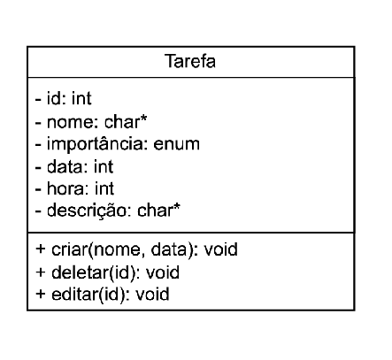
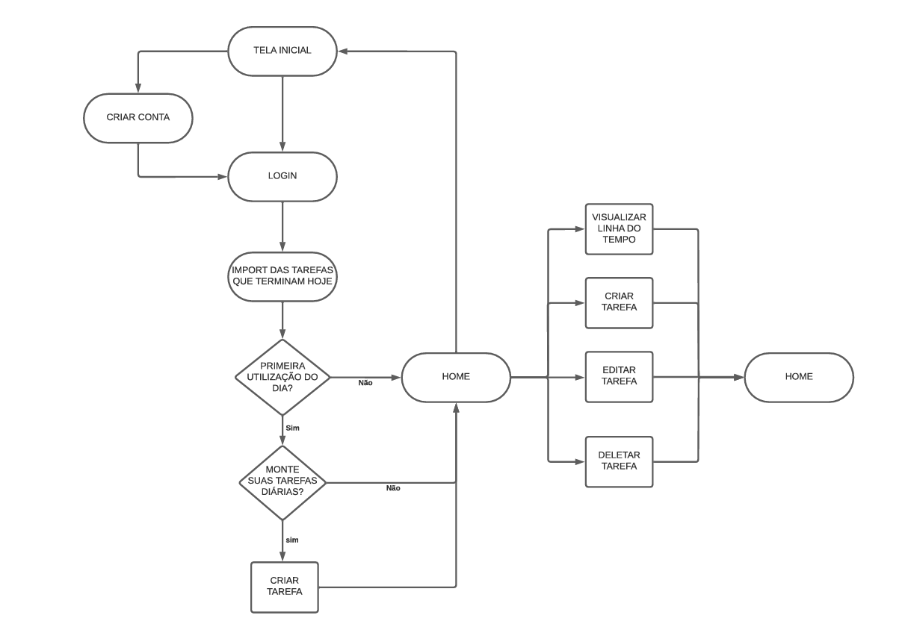
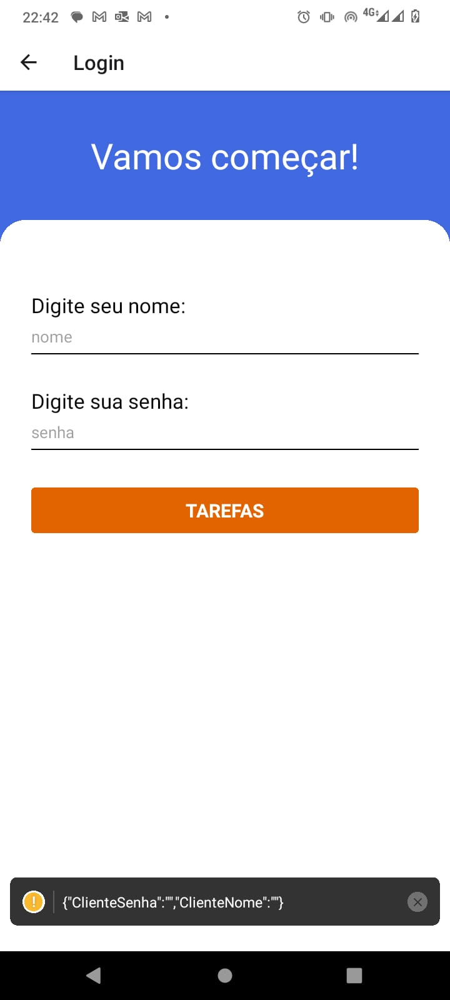
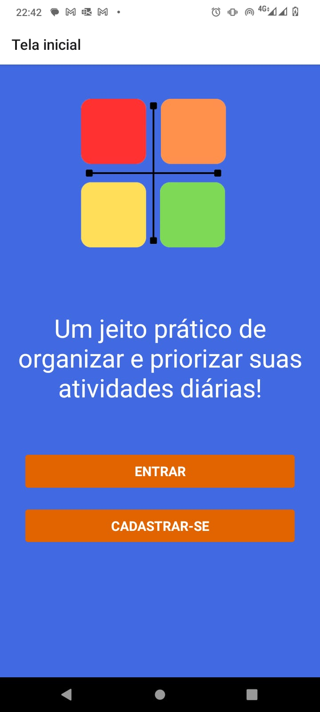
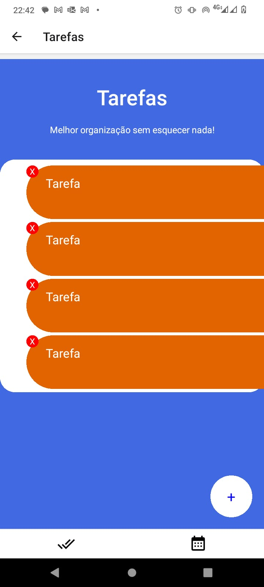
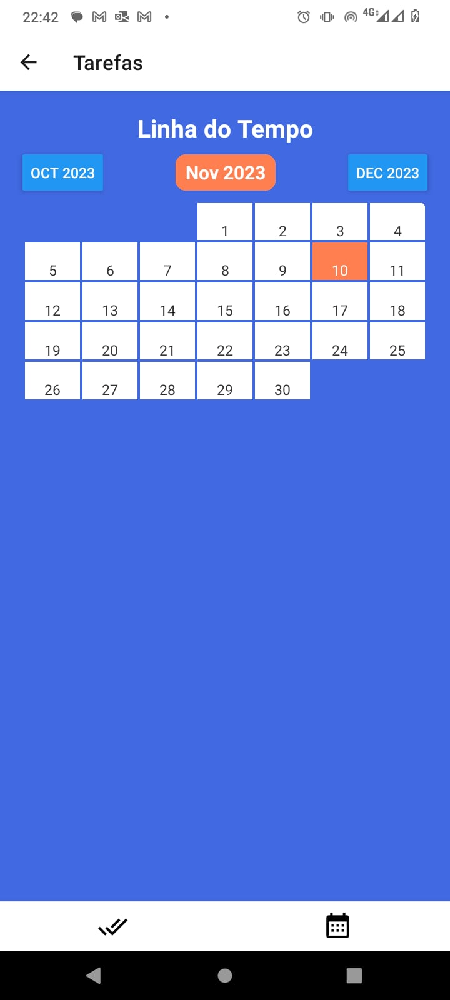

# To-Do List
## Descrição
O aplicativo de organização pessoal (To-Do List) em desenvolvimento tem como objetivo ajudar os usuários a gerenciar suas tarefas de forma eficiente, permitindo a criação de listas de afazeres diárias, mensais e tarefas de longo prazo, como projetos. O aplicativo oferece uma interface intuitiva que permite aos usuários classificar tarefas por prioridade e importância, destacando tarefas mais urgentes com cores diferentes para uma identificação rápida. Ele também permite que os usuários organizem suas metas a curto e longo prazo, incentivando um planejamento mais holístico.

## Função
A função principal do aplicativo é fornecer aos usuários uma ferramenta de gerenciamento de tarefas flexível e personalizável. Os usuários podem criar tarefas diárias para suas atividades cotidianas, tarefas mensais para objetivos de médio prazo e tarefas anuais para projetos de longo prazo. A capacidade de atribuir cores a tarefas com base em sua prioridade e importância ajuda os usuários a identificar rapidamente as tarefas críticas. Além disso, o aplicativo oferece lembretes e notificações para garantir que os usuários não percam prazos importantes.

## Motivação
A motivação por trás do desenvolvimento deste aplicativo é simplificar a vida dos usuários, ajudando-os a organizar suas tarefas de forma mais eficaz e alcançar seus objetivos pessoais e profissionais. Muitas vezes, as pessoas sentem-se sobrecarregadas pela quantidade de tarefas a serem realizadas, e este aplicativo visa proporcionar uma solução que permita aos usuários priorizar suas tarefas, dividindo-as em diferentes categorias e destacando as mais cruciais. A organização pessoal é fundamental para reduzir o estresse, aumentar a produtividade e alcançar um equilíbrio saudável entre trabalho e vida pessoal.

### Diagrama de classes e relacionamentos

### Fluxograma

## Resumo descritivo
O aplicativo To-do-List será feito em React Native e se baseia em gerenciamento de tarefas. A ideia principal é, após efetuado o login, o usuário se deparar com uma lista de afazeres diários com suas respectivas descrições, horários e grau de urgência indicados de forma limpa e intuitiva. A aplicação também fornece a possibilidade de Criar, Editar e Deletar tarefas, além de fornecer a possibilidade de se visualizar uma linha do tempo de tarefas para planejamento a longo prazo.

## Esboços do Projeto
#### Tela de Login

#### Tela de Registro

#### Tela inicial

#### Tela de tarefas do dia

#### Linha do tempo de tarefas

